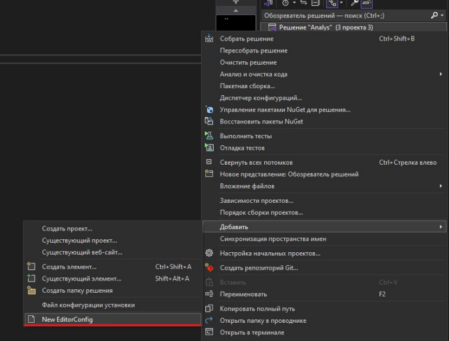
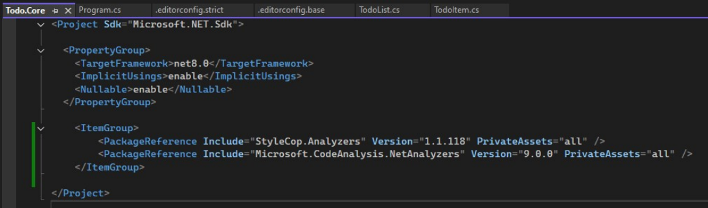
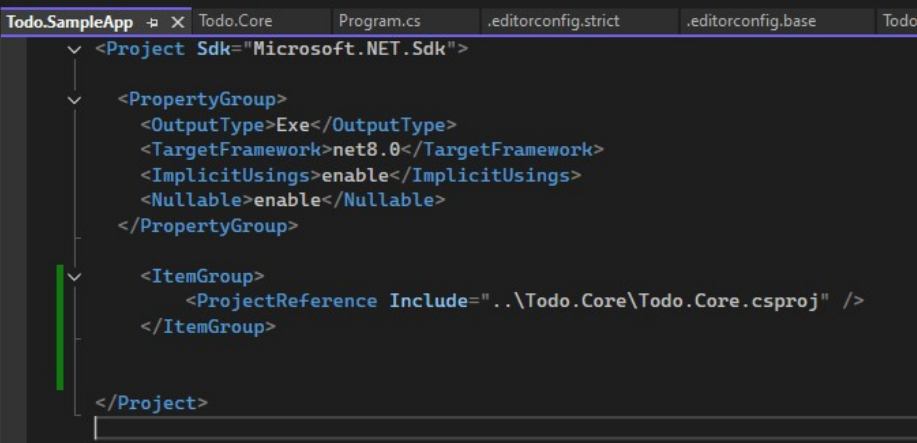
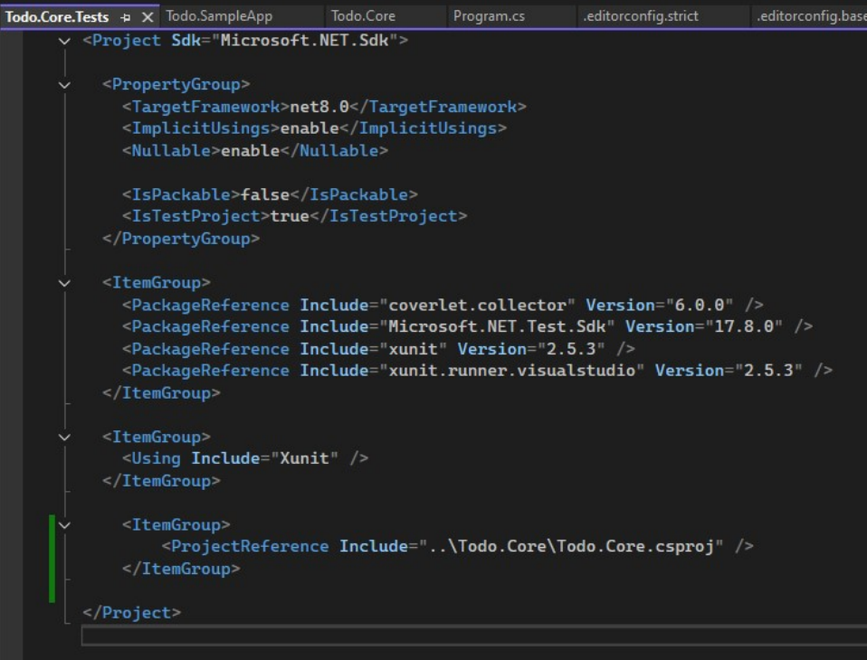

# Приложение А
(справочное)
## NuGet-пакет vs обычная сборка (DLL)
**DLL** —  это один файл сборки (.dll). Содержит ваш скомпилированный код. 
**NuGet-пакет (.nupkg)** — это архив (zip) с метаданными и одним или несколькими
артефактами (DLL, symbols, readme). Пакет предназначен для распространения и управления
зависимостями между проектами.  
  
Таблица сравнения  
|**Характеристика**|**Обычная сборка (DLL)**|**NuGet-пакет (.nupkg)**|
|---|---|---|
|Содержимое |Один или несколько .dll и ресурсы|.dll + метаданные (PackageId, Version,Description) + опционально symbols/readme|
|Распространение |Передаётся вручную (копирование / подключение) |Через репозиторий (nuget.org, GitHubPackages, приватный feed) |
|Управление зависимостями|Ручное (нужно вручную положить все зависимости в папку) |Автоматическое (NuGet подтягивает транзитивные зависимости) |
|Версионирование|Управляется вручную (файлы с разными именами/папками) |SemVer — версия пакета в метаданных →легко управлять версиями |
|Удобство использования|Подходит для простых локальных сценариев |Подходит для библиотек,   распространяемых между проектами/командами|
|Публикация через CI/CD|Копирование в артефакт хранилище / релиз |dotnet pack + dotnet nuget push → репозиторий пакетов|
|Поддержка зависимостей|Нет транзитивности |Да, NuGet управляет транзитивными зависимостями|
|Подпись и symbols|Можно подписать сборку, хранить pdb отдельно|Можно публиковать symbol package и source link|

## Когда что использовать (правило выбора)
**Используйте DLL:**
- при локальной проверке/прототипировании;
- если нужно быстро подключить одну сборку в один проект (малый scope);
- для внутренних артефактов без необходимости версионирования и распространения.
**Используйте NuGet-пакет:**
- если библиотека будет использоваться в нескольких проектах/репозиториях;
- если нужна явная версия и возможность откатиться/обновиться;
- хочется автоматизировать доставку через CI/CD (pack → push → install).  

## Приложение Б
(справочное)
## Пример реализации
**Здесь показана реализация без работы с  git`ом!!!**  

**1.Настройка проекта**  

Создайте проект с шаблоном «Новое решение». И создайте следующую структуру:  


Для добавления в проект файла .editorconfig.{base|strict} «Решение» -> «Добавить» -> «New EditorConfig»  

  

Добавьте зависимости  

Todo.Core:  


Здесь используется <PackageReference>, т.к. указанные пакеты будут загружать NuGetпакеты. При сборке пакет будет загружен и его артефакты (включая analyzers) будут применяться
к проекту.  

**StyleCop.Analyzers**  - набор анализаторов (StyleCop rules) для C# — проверяет стиль кода,
форматирование, file headers, порядок членов класса, правила наименование, XML-документацию
и т.д.  

**Microsoft.CodeAnalysis.NetAnalyzers** - официальный набор анализаторов .NET (правила
CAxxxx). Покрывает: безопасность, производительность, правильное использование API,
рекомендации по дизайну  

PrivateAssets="all" означает: этот пакет не будет экспортироваться как runtime/compileзависимость в проект, который ссылается на ваш пакет. Иными словами, анализаторы
используются **только во время сборки** вашего проекта, но не попадут в публикаемый .nupkg как
зависимость.  

Todo.SampleApp (либо через обозреватель решений добавить ссылку на Todo.Core):  
  

Todo.Core.Tests (либо через обозреватель решений добавить ссылку на Todo.Core):  
  

Далее реализуйте ранее созданные классы:  
TodoItem.cs:  
```csharp
namespace Todo.Core
{
 public class TodoItem
 {
 public Guid Id { get; } = Guid.NewGuid();
 public string Title { get; private set; }
 public bool IsDone { get; private set; }
 public TodoItem(string title)
 {
 Title = title?.Trim() ?? throw new ArgumentNullException(nameof(title));
 }
 public void MarkDone() => IsDone = true;
 public void MarkUndone() => IsDone = false;
 public void Rename(string newTitle)
 {
 if (string.IsNullOrWhiteSpace(newTitle))
 {
 throw new ArgumentException("Title is required", nameof(newTitle));
 }
 Title = newTitle.Trim();
 }
 }
}
```    
TodoList.cs:
```csharp
using System;
using System.Collections.Generic;
using System.Linq;
using System.Text;
using System.Threading.Tasks;
namespace Todo.Core
{
 public class TodoList
 {
 private readonly List<TodoItem> items = new();
 public IReadOnlyList<TodoItem> Items => items.AsReadOnly();
 public TodoItem Add(string title)
 {
 TodoItem item = new(title);
 this.items.Add(item);
 return item;
 }
 public bool Remove(Guid id)
 {
 return this.items.RemoveAll(i => i.Id == id) > 0;
 }
 public IEnumerable<TodoItem> Find(string substring)
 {
 return this.items.Where(i =>
 i.Title.Contains(substring ?? string.Empty,
StringComparison.OrdinalIgnoreCase));
 }
 public int Count => this.items.Count;
 }
}
```  
TodoListTests.cs:
```csharp
namespace Todo.Core.Tests
{
 public class TodoListTests
 {
 [Fact]
 public void AddIncrementsCount()
 {
 var list = new TodoList();
 _ = list.Add("task");
 Assert.Equal(1, list.Count);
 }
 [Fact]
 public void RemoveByIdWorks()
 {
 var list = new TodoList();
 var i = list.Add("a");
 Assert.True(list.Remove(i.Id));
 }
 }
}
```  
Следующим этапом является реализация .editconfig файлов.  

.editorconfig — основной инструмент управления диагностикой в .NET (IDE и компилятор
читают его). Через него вы задаёте уровни severity (suggestion / warning / error / none) для любых
диагностиок: IDExxx, CAxxxx, SAxxxx, Sxxxx и т.д. У нас 2 файла (набора правил):  
- .editorconfig.base — мягкий режим: подсказки/предупреждения, сборка не ломается.
Подходит для ранней разработки и обучения;  
-  .editorconfig.strict — жёсткий режим: многие диагностики превращены в ошибки;
используется как gate в CI, чтобы требовать чистого кода.  

.editorconfig.base:  
```
root = true
[*.cs]
# по умолчанию предупреждения
dotnet_analyzer_diagnostic.severity = suggestion
# выключим строгие StyleCop-правила для базового анализа
dotnet_diagnostic.SA1300.severity = none
dotnet_diagnostic.SA1600.severity = none
dotnet_diagnostic.SA1402.severity = none
# форматирование (нестрого)
indent_style = space
indent_size = 4
```
- root = true - файл считается корневым; поиск .editorconfig выше по файловой иерархии
прекращается. 
- [*.cs] — настройки применяются ко всем C# файлам.  
- dotnet_analyzer_diagnostic.severity = suggestion — по умолчанию все диагностические
правила будут отображаться как подсказки (не мешают сборке). Это удобно, чтобы разработчик
видел рекомендации, но CI/локальная сборка не падали.
- dotnet_diagnostic.SA1300.severity = none и т.п. — конкретные правила StyleCop
отключены в base, чтобы они не мешали.
- indent_style, indent_size — простые правила форматирования; IDE будет подсказывать
форматирование, но не принуждать.

.editorconfig.strict:  
```
root = true
[*.cs]
# Поднимать нарушения анализаторов как ошибки
dotnet_analyzer_diagnostic.severity = error
# Включим некоторые StyleCop правила как ошибки
dotnet_diagnostic.SA1300.severity = error # Element should begin with upper-case letter
dotnet_diagnostic.SA1600.severity = error # Elements must be documented
dotnet_diagnostic.SA1402.severity = error # File may only contain a single type
# правила форматирования
indent_style = space
indent_size = 4
```  
- dotnet_analyzer_diagnostic.severity = error — глобально повышает все анализаторы до
уровня ошибки. Это жёсткая настройка: при dotnet build (или если CI ставит warnings as errors)
сборка упадёт при любом нарушении.
- Конкретные SAxxxx вынесены явно (SA1300, SA1600, SA1402).
- Форматирование остаётся одинаковым.  

**Как тонко настраивать правила (примеры )**  

Сделать конкретное правило warning: 
``
