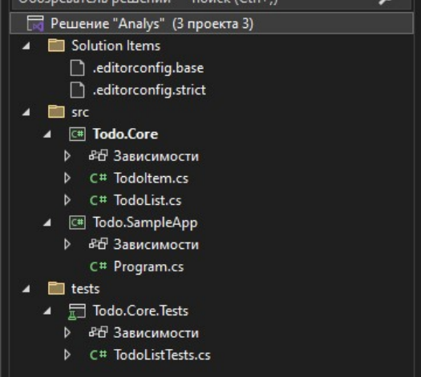

# Приложение А
(справочное)
## NuGet-пакет vs обычная сборка (DLL)
**DLL** —  это один файл сборки (.dll). Содержит ваш скомпилированный код. 
**NuGet-пакет (.nupkg)** — это архив (zip) с метаданными и одним или несколькими
артефактами (DLL, symbols, readme). Пакет предназначен для распространения и управления
зависимостями между проектами.  
  
Таблица сравнения  
|**Характеристика**|**Обычная сборка (DLL)**|**NuGet-пакет (.nupkg)**|
|---|---|---|
|Содержимое |Один или несколько .dll и ресурсы|.dll + метаданные (PackageId, Version,Description) + опционально symbols/readme|
|Распространение |Передаётся вручную (копирование / подключение) |Через репозиторий (nuget.org, GitHubPackages, приватный feed) |
|Управление зависимостями|Ручное (нужно вручную положить все зависимости в папку) |Автоматическое (NuGet подтягивает транзитивные зависимости) |
|Версионирование|Управляется вручную (файлы с разными именами/папками) |SemVer — версия пакета в метаданных →легко управлять версиями |
|Удобство использования|Подходит для простых локальных сценариев |Подходит для библиотек,   распространяемых между проектами/командами|
|Публикация через CI/CD|Копирование в артефакт хранилище / релиз |dotnet pack + dotnet nuget push → репозиторий пакетов|
|Поддержка зависимостей|Нет транзитивности |Да, NuGet управляет транзитивными зависимостями|
|Подпись и symbols|Можно подписать сборку, хранить pdb отдельно|Можно публиковать symbol package и source link|

## Когда что использовать (правило выбора)
**Используйте DLL:**
- при локальной проверке/прототипировании;
- если нужно быстро подключить одну сборку в один проект (малый scope);
- для внутренних артефактов без необходимости версионирования и распространения.
**Используйте NuGet-пакет:**
- если библиотека будет использоваться в нескольких проектах/репозиториях;
- если нужна явная версия и возможность откатиться/обновиться;
- хочется автоматизировать доставку через CI/CD (pack → push → install).  

## Приложение Б
(справочное)
## Пример реализации
**Здесь показана реализация без работы с  git`ом!!!**  

**1.Настройка проекта**  

Создайте проект с шаблоном «Новое решение». И создайте следующую структуру:  

