# Приложение А

(справочное)

## NuGet-пакет vs обычная сборка (DLL)

**DLL** —  это один файл сборки (.dll). Содержит ваш скомпилированный код.
**NuGet-пакет (.nupkg)** — это архив (zip) с метаданными и одним или несколькими
артефактами (DLL, symbols, readme). Пакет предназначен для распространения и управления
зависимостями между проектами.  
  
Таблица сравнения

|**Характеристика**|**Обычная сборка (DLL)**|**NuGet-пакет (.nupkg)**|
|---|---|---|
|Содержимое |Один или несколько .dll и ресурсы|.dll + метаданные (PackageId, Version,Description) + опционально symbols/readme|
|Распространение |Передаётся вручную (копирование / подключение) |Через репозиторий (nuget.org, GitHubPackages, приватный feed) |
|Управление зависимостями|Ручное (нужно вручную положить все зависимости в папку) |Автоматическое (NuGet подтягивает транзитивные зависимости) |
|Версионирование|Управляется вручную (файлы с разными именами/папками) |SemVer — версия пакета в метаданных →легко управлять версиями |
|Удобство использования|Подходит для простых локальных сценариев |Подходит для библиотек,   распространяемых между проектами/командами|
|Публикация через CI/CD|Копирование в артефакт хранилище / релиз |dotnet pack + dotnet nuget push → репозиторий пакетов|
|Поддержка зависимостей|Нет транзитивности |Да, NuGet управляет транзитивными зависимостями|
|Подпись и symbols|Можно подписать сборку, хранить pdb отдельно|Можно публиковать symbol package и source link|

## Когда что использовать (правило выбора)

**Используйте DLL:**

- при локальной проверке/прототипировании;
- если нужно быстро подключить одну сборку в один проект (малый scope);
- для внутренних артефактов без необходимости версионирования и распространения.
**Используйте NuGet-пакет:**
- если библиотека будет использоваться в нескольких проектах/репозиториях;
- если нужна явная версия и возможность откатиться/обновиться;
- хочется автоматизировать доставку через CI/CD (pack → push → install).  

## Приложение Б

(справочное)

## Пример реализации

**Здесь показана реализация без работы с  git`ом!!!**  

**1.Настройка проекта**  

Создайте проект с шаблоном «Новое решение». И создайте следующую структуру:  


Для добавления в проект файла .editorconfig.{base|strict} «Решение» -> «Добавить» -> «New EditorConfig»  

  

Добавьте зависимости  

Todo.Core:  


Здесь используется <PackageReference>, т.к. указанные пакеты будут загружать NuGetпакеты. При сборке пакет будет загружен и его артефакты (включая analyzers) будут применяться
к проекту.  

**StyleCop.Analyzers**  - набор анализаторов (StyleCop rules) для C# — проверяет стиль кода,
форматирование, file headers, порядок членов класса, правила наименование, XML-документацию
и т.д.  

**Microsoft.CodeAnalysis.NetAnalyzers** - официальный набор анализаторов .NET (правила
CAxxxx). Покрывает: безопасность, производительность, правильное использование API,
рекомендации по дизайну  

PrivateAssets="all" означает: этот пакет не будет экспортироваться как runtime/compileзависимость в проект, который ссылается на ваш пакет. Иными словами, анализаторы
используются **только во время сборки** вашего проекта, но не попадут в публикаемый .nupkg как
зависимость.  

Todo.SampleApp (либо через обозреватель решений добавить ссылку на Todo.Core):  
  

Todo.Core.Tests (либо через обозреватель решений добавить ссылку на Todo.Core):  
  

Далее реализуйте ранее созданные классы:  
TodoItem.cs:  
```csharp
namespace Todo.Core
{
 public class TodoItem
 {
 public Guid Id { get; } = Guid.NewGuid();
 public string Title { get; private set; }
 public bool IsDone { get; private set; }
 public TodoItem(string title)
 {
 Title = title?.Trim() ?? throw new ArgumentNullException(nameof(title));
 }
 public void MarkDone() => IsDone = true;
 public void MarkUndone() => IsDone = false;
 public void Rename(string newTitle)
 {
 if (string.IsNullOrWhiteSpace(newTitle))
 {
 throw new ArgumentException("Title is required", nameof(newTitle));
 }
 Title = newTitle.Trim();
 }
 }
}

```

TodoList.cs:

```csharp
using System;
using System.Collections.Generic;
using System.Linq;
using System.Text;
using System.Threading.Tasks;
namespace Todo.Core
{
 public class TodoList
 {
 private readonly List<TodoItem> items = new();
 public IReadOnlyList<TodoItem> Items => items.AsReadOnly();
 public TodoItem Add(string title)
 {
 TodoItem item = new(title);
 this.items.Add(item);
 return item;
 }
 public bool Remove(Guid id)
 {
 return this.items.RemoveAll(i => i.Id == id) > 0;
 }
 public IEnumerable<TodoItem> Find(string substring)
 {
 return this.items.Where(i =>
 i.Title.Contains(substring ?? string.Empty,
StringComparison.OrdinalIgnoreCase));
 }
 public int Count => this.items.Count;
 }
}
```  

TodoListTests.cs:

```csharp
namespace Todo.Core.Tests
{
 public class TodoListTests
 {
 [Fact]
 public void AddIncrementsCount()
 {
 var list = new TodoList();
 _ = list.Add("task");
 Assert.Equal(1, list.Count);
 }
 [Fact]
 public void RemoveByIdWorks()
 {
 var list = new TodoList();
 var i = list.Add("a");
 Assert.True(list.Remove(i.Id));
 }
 }
}
```  

Следующим этапом является реализация .editconfig файлов.  

.editorconfig — основной инструмент управления диагностикой в .NET (IDE и компилятор
читают его). Через него вы задаёте уровни severity (suggestion / warning / error / none) для любых
диагностиок: IDExxx, CAxxxx, SAxxxx, Sxxxx и т.д. У нас 2 файла (набора правил):  

- .editorconfig.base — мягкий режим: подсказки/предупреждения, сборка не ломается.

Подходит для ранней разработки и обучения;  

- .editorconfig.strict — жёсткий режим: многие диагностики превращены в ошибки;
используется как gate в CI, чтобы требовать чистого кода.  

.editorconfig.base:  
```
root = true
[*.cs]
# по умолчанию предупреждения
dotnet_analyzer_diagnostic.severity = suggestion
# выключим строгие StyleCop-правила для базового анализа
dotnet_diagnostic.SA1300.severity = none
dotnet_diagnostic.SA1600.severity = none
dotnet_diagnostic.SA1402.severity = none
# форматирование (нестрого)
indent_style = space
indent_size = 4

```

- root = true - файл считается корневым; поиск .editorconfig выше по файловой иерархии
прекращается.
- [*.cs] — настройки применяются ко всем C# файлам.  
- dotnet_analyzer_diagnostic.severity = suggestion — по умолчанию все диагностические
правила будут отображаться как подсказки (не мешают сборке). Это удобно, чтобы разработчик
видел рекомендации, но CI/локальная сборка не падали.
- dotnet_diagnostic.SA1300.severity = none и т.п. — конкретные правила StyleCop
отключены в base, чтобы они не мешали.
- indent_style, indent_size — простые правила форматирования; IDE будет подсказывать
форматирование, но не принуждать.

.editorconfig.strict:  

```
root = true
[*.cs]
# Поднимать нарушения анализаторов как ошибки
dotnet_analyzer_diagnostic.severity = error
# Включим некоторые StyleCop правила как ошибки
dotnet_diagnostic.SA1300.severity = error # Element should begin with upper-case letter
dotnet_diagnostic.SA1600.severity = error # Elements must be documented
dotnet_diagnostic.SA1402.severity = error # File may only contain a single type
# правила форматирования
indent_style = space
indent_size = 4
```  

- dotnet_analyzer_diagnostic.severity = error — глобально повышает все анализаторы до
уровня ошибки. Это жёсткая настройка: при dotnet build (или если CI ставит warnings as errors)
сборка упадёт при любом нарушении.
- Конкретные SAxxxx вынесены явно (SA1300, SA1600, SA1402).
- Форматирование остаётся одинаковым.  

**Как тонко настраивать правила (примеры )**  

Сделать конкретное правило warning:
`dotnet_diagnostic.SA1300.severity = warning`  

Отключить правило:  
`dotnet_diagnostic.SA1600.severity = none`  

Настроить Roslyn rule (например, IDE0003):  
`dotnet_diagnostic.IDE0003.severity = suggestion`  

**Как временно подавить правило в коде (если нужно)**  
В конкретном месте:

```
#pragma warning disable SA1101  
// код вызывающий правило
```  

Для целого проекта (csproj):  

```
ropertyGroup>
 <NoWarn>SA1101;SA1633</NoWarn>
</PropertyGroup> 
```

Для целого проекта (csproj):

```
<PropertyGroup>
 <NoWarn>SA1101;SA1633</NoWarn>
</PropertyGroup>  
```

**Как использовать (быстро) правила для анализа**  

Локально. Откройте PowerShell:  
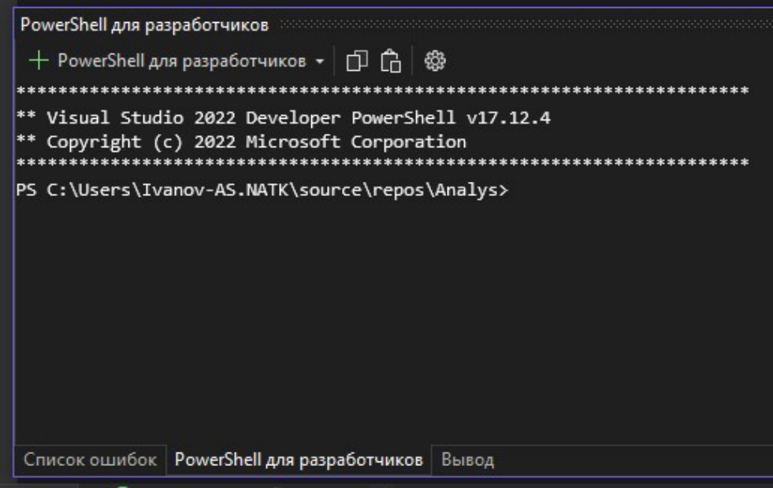  

Для сборки проекта:  

```
# восстановить и собрать
dotnet restore
dotnet build -c Release
dotnet test -c Release
# собрать пакет (опционально)
dotnet pack Todo.Core/Todo.Core.csproj -c Release -o ./artifacts
```  

Для анализа (локально можно переключать .editorconfig). Для переключения к базовому
анализу введите:  

```
# базовый анализ
cp .editorconfig.base .editorconfig
dotnet build -c Release
```  

Результат:  
  

Для переключения к строгому анализу введите:

```
# строгий анализ
cp .editorconfig.strict .editorconfig
dotnet build -c Release 
```  
Результат:  
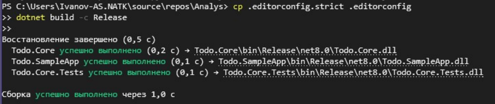

В GitHub Actions workflow оба анализа выполняются автоматически и сохраняют логи в
артефакты.  

В зависимости от включенного анализа IDE будет показывать соответсвтующие ошибки,
предупреждения и сообщения.  

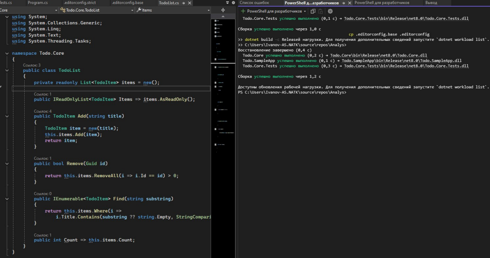  

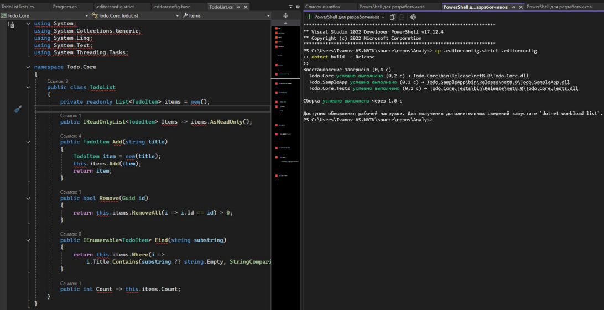  

Следующим шагом необходимо добавить в проект .github/workflows/ci-analysis.yml  
```yml
name: CI / Build & Static Analysis
on:
 push:
 branches: [ master ]
 pull_request:
 branches: [ master ]
jobs:
 build-and-analyze:
 runs-on: ubuntu-latest
 steps:
 - name: Checkout
 uses: actions/checkout@v4
 - name: Setup .NET
 uses: actions/setup-dotnet@v3
 with:
 dotnet-version: '8.0.x'
 - name: Cache NuGet packages
 uses: actions/cache@v4
 with:
 path: ~/.nuget/packages
 key: ${{ runner.os }}-nuget-${{ hashFiles('**/*.csproj') }}
 restore-keys: |
 ${{ runner.os }}-nuget-
 - name: Restore
 run: dotnet restore
 - name: Build & Test (baseline)
 run: |
 # Используем базовый набор правил
 cp .editorconfig.base .editorconfig
 echo "=== BUILD (base rules) ==="
 dotnet build --no-restore -c Release | tee build-base.log || true
 dotnet test --no-build -c Release | tee test-base.log || true
 - name: Upload base analysis logs
 uses: actions/upload-artifact@v4
 with:
 name: analysis-base-logs
 path: |
 build-base.log
 test-base.log
 - name: Build & Test (strict)
 run: |
 # Используем строгий набор правил
 cp .editorconfig.strict .editorconfig
 echo "=== BUILD (strict rules) ==="
 dotnet build --no-restore -c Release | tee build-strict.log || true
 dotnet test --no-build -c Release | tee test-strict.log || true
 - name: Upload strict analysis logs
 uses: actions/upload-artifact@v4
 with:
 name: analysis-strict-logs
 path: |
 build-strict.log
 test-strict.log
 ```

 Пояснение:  
1. on:

```yml
on:
 push:
 branches: [ master ]
 pull_request:
 branches: [ master ]
 ```

 Триггеры запуска:

- push в master — при прямом коммите в главную ветку.
- pull_request в master — при создании/обновлении PR.
Таким образом, анализ запускается и на PR, и на коммитах в основную ветку.

2. jobs.build-and-analyze:

```yml
jobs:
 build-and-analyze:
 runs-on: ubuntu-latest
 ```

 Определяет джоб (job = набор шагов)
 Запускается на виртуальной машине GitHub с Ubuntu (ubuntu-latest).

3. Checkout

```yml
- name: Checkout
 uses: actions/checkout@v4
 ```

 Скачивает код репозитория в раннер. Без этого GitHub Actions ничего не увидит.

 4. Setup .NET

 ```yml
 name: Setup .NET
 uses: actions/setup-dotnet@v3
 with:
 dotnet-version: '8.0.x'
 ```
Устанавливает .NET SDK версии 8.0 (актуальная для вашего проекта).

Без этого команды dotnet build/test не будут работать. 
5. Кэш NuGet

```yml
- name: Cache NuGet packages
 uses: actions/cache@v4
 with:
 path: ~/.nuget/packages
 key: ${{ runner.os }}-nuget-${{ hashFiles('**/*.csproj') }}
 restore-keys: |
 ${{ runner.os }}-nuget
 ```

 Оптимизация: кэширует скачанные NuGet-пакеты.  

 **~/.nuget/packages** — стандартный путь, где dotnet хранит пакеты.  

 **key** зависит от хэша .csproj, чтобы кэш обновлялся, если зависимости изменятся

 6. Restore  

```yml
 e: Restore
 run: dotnet restore
```
Восстанавливает все зависимости NuGet.  

7 Build & Test (baseline)

```yml
- name: Build & Test (baseline)
 run: |
 # Используем базовый набор правил
 cp .editorconfig.base .editorconfig
 echo "=== BUILD (base rules) ==="
 dotnet build --no-restore -c Release | tee build-base.log || true
 dotnet test --no-build -c Release | tee test-base.log || true
 ```
 В этой части:

 Подключается мягкий набор правил (.editorconfig.base).

- Выполняется dotnet build и dotnet test с этим конфигом.

- tee build-base.log — сохраняет вывод в лог-файл и показывает его в консоли.

- || true — делает шаг невалидационным (даже если есть ошибки). То есть build может

упасть, но workflow всё равно пойдёт дальше → чтобы можно было зафиксировать ошибки для
анализа, а не сразу обрывать CI.

Результаты сохраняются в:build-base.log и test-base.log  

8. Upload base analysis logs

```yml
- name: Upload base analysis logs
 uses: actions/upload-artifact@v4
 with:
 name: analysis-base-logs
 path: |
 build-base.log
 test-base.log
 ```  
 Загружает полученные логи как артефакты CI.  

 9. Build & Test (strict)  

 ```yml
 - name: Build & Test (strict)
 run: |
 # Используем строгий набор правил
 cp .editorconfig.strict .editorconfig
 echo "=== BUILD (strict rules) ==="
 dotnet build --no-restore -c Release | tee build-strict.log || true
 dotnet test --no-build -c Release | tee test-strict.log || true
```

Повторяем сборку и тесты, но уже со строгим набором правил (.editorconfig.strict). Сборка фактически должна упасть, если код не соответствует правилам.  
Здесь снова стоит || true, поэтому workflow не падает, а просто фиксирует результат в логах.  
Для строго набора правил можно убрать || true, чтобы workflow падал, и во время пулреквеста не пропускался некачественный код.  

10. Upload strict analysis logs

```yml
 name: Upload strict analysis logs
 uses: actions/upload-artifact@v4
 with:
 name: analysis-strict-logs
 path: |
 build-strict.log
 test-strict.log
 ```

 Аналогично базовому шагу, сохраняются логи **строгой проверки**. 

 В итоге workflow:  

 1. **Собирает проект и запускает тесты в двух режимах анализа**:
- base — мягкие правила, больше подсказок и предупреждений.
- strict — строгие правила, ошибки анализаторов.
2. **Не прерывает CI** (|| true), а собирает все логи.
3. **Загружает артефакты** с результатами обоих прогонов, чтобы можно было проверить
качество кода и соблюдение правил.  

При отправке изменений в github репозиторий на вкладке Actions по данному workflow
будет общая информация, информация об ошибкой в коде (если они есть) и артефакты:  

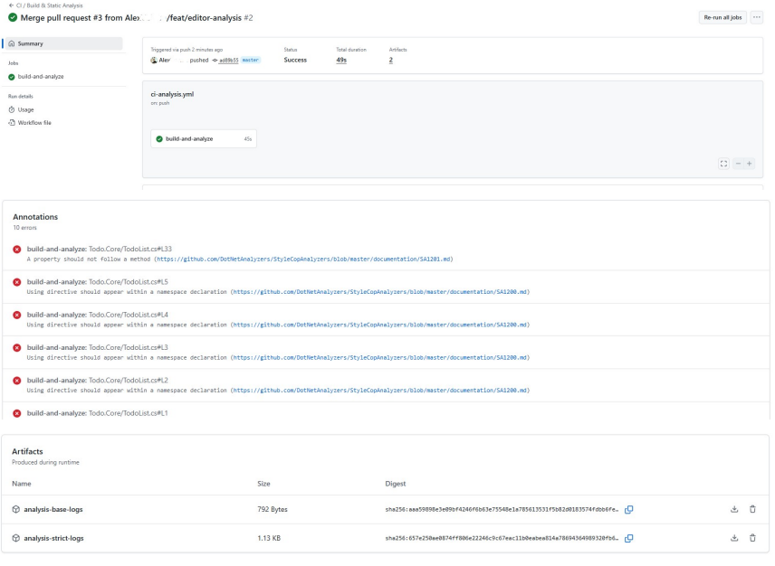  

Далее измените набор строгих правил в editorconfig.strict (чтобы убрать ошибки):  

```
root = true
[*.cs]
dotnet_analyzer_diagnostic.severity = error
# Имена — предупреждение
dotnet_diagnostic.SA1300.severity = warning # Element should begin with upper-case letter
dotnet_diagnostic.SA1310.severity = warning # Field names should not contain underscores
# Документация — suggestion
dotnet_diagnostic.SA1600.severity = suggestion # Elements must be documented(XML-comments)
# Несколько типов в файле — ошибка
dotnet_diagnostic.SA1402.severity = error # File may only contain a single type
# Разрешаем var
dotnet_diagnostic.IDE0007.severity = none # Use implicit type
dotnet_diagnostic.IDE0008.severity = none # Use explicit type
# Разрешаем expression-bodied методы
dotnet_diagnostic.IDE0022.severity = none # Use expression body for methods
# Разрешаем new()
dotnet_diagnostic.IDE0090.severity = none # Simplify new()
dotnet_diagnostic.SA1000.severity = none # Spacing around keywords
dotnet_diagnostic.SA1200.severity = none # Using must be inside namespace
# Не требовать this.
dotnet_diagnostic.SA1101.severity = none # Prefix local calls with this
dotnet_diagnostic.IDE0003.severity = none # Remove 'this.' qualifier
dotnet_diagnostic.IDE0009.severity = warning # Add 'this.' qualifier
dotnet_diagnostic.SA1516.severity = none # Elements should be separated by blank line
dotnet_diagnostic.SA1201.severity = none # Elements should be ordered by access
dotnet_diagnostic.IDE0005.severity = none # Remove unnecessary usings
dotnet_diagnostic.IDE0028.severity = none # Collection initialization can be simplified
dotnet_diagnostic.IDE0290.severity = warning # Primary constructor
dotnet_diagnostic.SA1636.severity = suggestion # File header text should match settings
# Стиль отступов (4 пробела на уровень)
indent_style = space
indent_size = 4
```

В итоге:
| **Правило / Диагностика**| **Назначение**|**Уровень**|
|---|---|---|
| dotnet_analyzer_diagnostic.severity|Все диагностики по умолчанию|**error**|
| SA1402| Один файл = один тип|**error**|
| SA1300| Имя должно начинаться с заглавной буквы|**warning**|
| SA1310| Поля не должны содержать _|**warning**|
| IDE0009| Добавить this.|**warning**|
| IDE0290| Использовать primary constructor (C# 12)| **warning**|
| SA1600| Требуется XML-документация |**suggestion**|
| SA1636| Copyright header должен совпадать с настройками|**suggestion**|
| IDE0007| Использовать var|**none**|
| IDE0008| Использовать явный тип вместо var |**none**|
| IDE0022| Разрешить expression-bodied методы|**none**|
| IDE0090| Упрощать new()|**none**|
| SA1000| Пробелы после new|**none**|
| SA1200| using внутри namespace|**none**|
| SA1101| Требовать this.|**none**|
| IDE0003| Удалить this.|**none**|
| SA1516| Пустые строки между элементами|**none**|
| SA1201| Порядок членов класса (public/private) |**none**|
| IDE0005| Удалять неиспользуемые using|**none**|
| IDE0028| Упрощение инициализации коллекций|**none**|

Если переключиться к этому анализу, то увидим ошибки, которые связаны с отсутствием copyright текста к файлам библиотеки.  
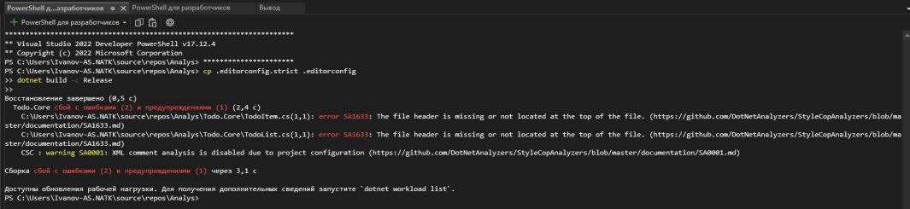  

Для исправления ошибок можно, либо добавить заголовки, либо изменить правило.
Добавьте заголовки для TodoItem и TodoList:
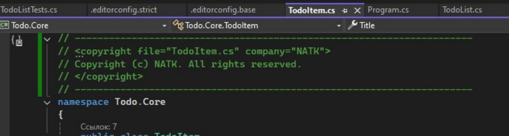  

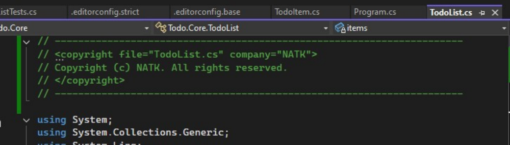  

Если заново переключиться к строгому анализу, после внесения изменений, то выведется следующее сообщение:
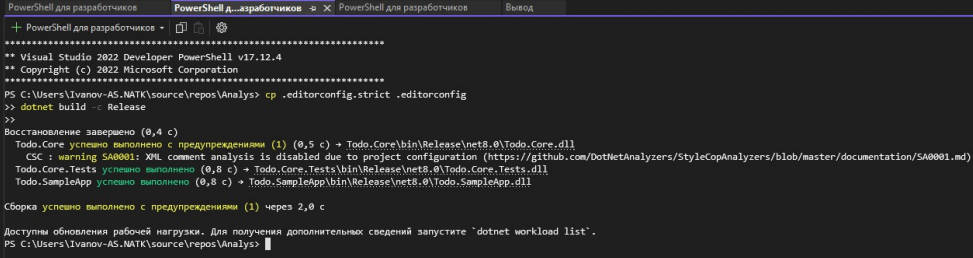

Т.к. наш workflow настроен на пул-реквест, то при создании PR он отобразиться перед
мерджем:  
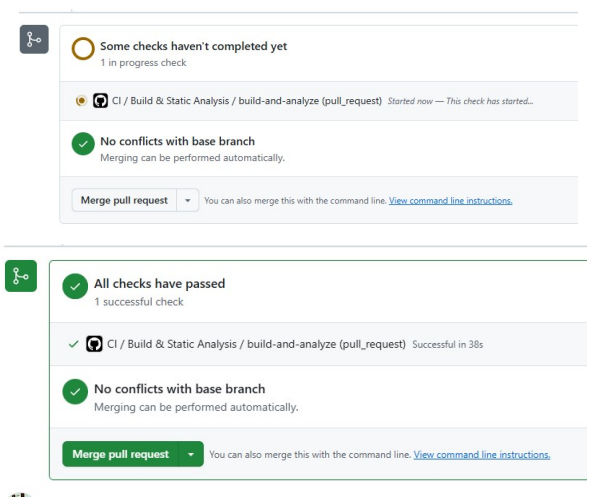  

После отправки изменений в github репозиторий на вкладке Actions по данному workflow,
информация об ошибках будет отсутствовать:  
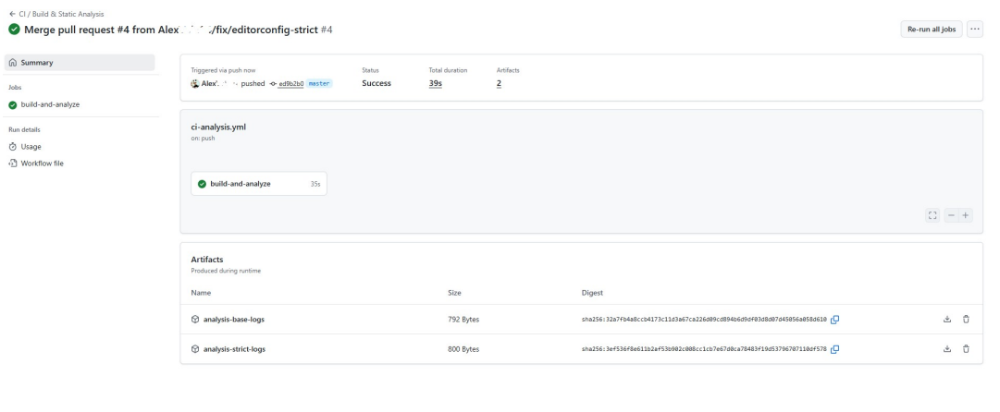